# 🚨 AI-Powered Crime Hotspot Prediction Using Real-Time Social Media Data

<p align="center">


</p>

<p align="center">

<b>AI-powered spatio-temporal crime hotspot analysis and prediction using historical crime data and real-time social signals.</b>

</p>

---

## 📌 Table of Contents

* [1. Project Overview](#1-project-overview)
* [2. Project Title](#2-project-title)
* [3. Team](#3-team)
* [4. Abstract](#4-abstract)
* [5. Core Idea](#5-core-idea)
* [6. Problem Statement](#6-problem-statement)
* [7. Motivation](#7-motivation)
* [8. Objectives](#8-objectives)
* [9. Proposed Solution](#9-proposed-solution)
* [10. Key Features](#10-key-features)
* [11. System Architecture](#11-system-architecture)
* [12. Complete System Flow](#12-complete-system-flow)
* [13. Data Flow Diagram](#13-data-flow-diagram)
* [14. Detailed Processing Pipeline](#14-detailed-processing-pipeline)
* [15. Module 1 — Data Collection](#15-module-1--data-collection)
* [16. Module 2 — Social Media Processing](#16-module-2--social-media-processing)
* [17. Module 3 — NLP Using mBERT](#17-module-3--nlp-using-mbert)
* [18. Module 4 — Location Extraction](#18-module-4--location-extraction)
* [19. Module 5 — Geocoding Using GeoPy](#19-module-5--geocoding-using-geopy)
* [20. Module 6 — Data Fusion](#20-module-6--data-fusion)
* [21. Module 7 — Feature Engineering](#21-module-7--feature-engineering)
* [22. Module 8 — Spatial Clustering](#22-module-8--spatial-clustering)
* [23. Module 9 — LSTM Prediction](#23-module-9--lstm-prediction)
* [24. Module 10 — Explainable AI Using SHAP](#24-module-10--explainable-ai-using-shap)
* [25. Module 11 — Flask Backend](#25-module-11--flask-backend)
* [26. Module 12 — React Frontend](#26-module-12--react-frontend)
* [27. Module 13 — Leaflet Visualization](#27-module-13--leaflet-visualization)
* [28. End-to-End Example](#28-end-to-end-example)
* [29. System Sequence Diagram](#29-system-sequence-diagram)
* [30. Component Diagram](#30-component-diagram)
* [31. Deployment Architecture](#31-deployment-architecture)
* [32. Database/Data Model](#32-databasedata-model)
* [33. Machine Learning Pipeline](#33-machine-learning-pipeline)
* [34. NLP Pipeline](#34-nlp-pipeline)
* [35. Prediction Pipeline](#35-prediction-pipeline)
* [36. Explainability Pipeline](#36-explainability-pipeline)
* [37. Technology Stack](#37-technology-stack)
* [38. Why These Technologies](#38-why-these-technologies)
* [39. Repository Structure](#39-repository-structure)
* [40. Installation](#40-installation)
* [41. Configuration](#41-configuration)
* [42. Environment Variables](#42-environment-variables)
* [43. Running the Project](#43-running-the-project)
* [44. Backend API](#44-backend-api)
* [45. Frontend](#45-frontend)
* [46. Data Processing](#46-data-processing)
* [47. Model Training](#47-model-training)
* [48. Model Inference](#48-model-inference)
* [49. API Workflow](#49-api-workflow)
* [50. Input and Output](#50-input-and-output)
* [51. Example Prediction](#51-example-prediction)
* [52. Dashboard](#52-dashboard)
* [53. Visualization Strategy](#53-visualization-strategy)
* [54. Explainability](#54-explainability)
* [55. Advantages](#55-advantages)
* [56. Limitations](#56-limitations)
* [57. Challenges](#57-challenges)
* [58. Data Quality Considerations](#58-data-quality-considerations)
* [59. Privacy and Security](#59-privacy-and-security)
* [60. Ethical Considerations](#60-ethical-considerations)
* [61. Responsible Use](#61-responsible-use)
* [62. Applications](#62-applications)
* [63. Future Enhancements](#63-future-enhancements)
* [64. Research Scope](#64-research-scope)
* [65. Testing Strategy](#65-testing-strategy)
* [66. Performance Considerations](#66-performance-considerations)
* [67. Error Handling](#67-error-handling)
* [68. Reproducibility](#68-reproducibility)
* [69. Security Checklist](#69-security-checklist)
* [70. Development Workflow](#70-development-workflow)
* [71. GitHub Workflow](#71-github-workflow)
* [72. Documentation](#72-documentation)
* [73. Project Timeline](#73-project-timeline)
* [74. Academic Contribution](#74-academic-contribution)
* [75. Project Novelty](#75-project-novelty)
* [76. Viva Explanation](#76-viva-explanation)
* [77. Frequently Asked Questions](#77-frequently-asked-questions)
* [78. Glossary](#78-glossary)
* [79. Future Research Directions](#79-future-research-directions)
* [80. Conclusion](#80-conclusion)
* [81. Team](#81-team)
* [82. Acknowledgements](#82-acknowledgements)
* [83. Disclaimer](#83-disclaimer)
* [84. License](#84-license)

---

# 1. Project Overview

**AI-Powered Crime Hotspot Prediction Using Real-Time Social Media Data** is an Artificial Intelligence and Machine Learning based system designed to analyze crime-related information from multiple sources and identify areas that may exhibit elevated crime activity.

The system combines:

* Historical crime information
* Real-time or near-real-time social media signals
* Natural Language Processing
* Location extraction
* Geocoding
* Spatial analysis
* Temporal analysis
* LSTM-based prediction
* Explainable AI
* Interactive geographic visualization

The central idea is to treat publicly available social signals as an additional source of information that can complement traditional historical crime datasets.

Instead of analyzing crime only after incidents have been formally recorded, the system attempts to identify emerging patterns from recent public information.

---

# 2. Project Title

## AI-Powered Crime Hotspot Prediction Using Real-Time Social Media Data

### Short Name

**AI Crime Hotspot Prediction**

### Project Type

* Artificial Intelligence
* Machine Learning
* Natural Language Processing
* Spatio-Temporal Analytics
* Explainable AI
* Web Application
* Data Visualization

### Academic Level

**Third-Year B.Tech Computer Science and Engineering Project**

---

# 3. Team

## Project Team

| S.No | Team Member                    |
| ---: | ------------------------------ |
|    1 | **Thurupu Tharun**             |
|    2 | **V Yaswanth Kumar**           |
|    3 | **Pathan Mohammed Akram Khan** |
|    4 | **C Rishi Sudeep**             |

---

## Team Contribution Areas

The project integrates multiple areas of software engineering and AI research.

Typical contribution areas include:

* Data collection
* Dataset preparation
* Data preprocessing
* NLP processing
* Model development
* Feature engineering
* Prediction
* Explainability
* Backend development
* Frontend development
* Map visualization
* Testing
* Documentation
* Project integration

---

# 4. Abstract

Crime analysis traditionally relies heavily on historical police records, incident reports, and structured datasets. Although these sources are valuable, they may not always provide immediate information about rapidly changing situations.

This project proposes an AI-powered crime hotspot prediction system that combines historical crime data with crime-related information extracted from public social media and online sources.

The system uses Natural Language Processing techniques to identify relevant crime-related information from textual data. A multilingual language model such as **mBERT** can be used to identify entities such as crime types and locations.

Extracted locations are converted into geographic coordinates using geocoding techniques. The resulting information is combined with historical crime data to construct a unified spatio-temporal dataset.

Machine learning techniques are then used to identify spatial and temporal patterns. An **LSTM-based model** can learn sequential patterns and estimate the probability of elevated crime activity in a geographic region.

To improve transparency, **SHAP (SHapley Additive exPlanations)** is incorporated to provide feature-level explanations for model predictions.

The final predictions are presented through an interactive map-based dashboard using **React.js and Leaflet.js**, with a Flask-based backend providing data processing and prediction services.

The system is intended as a research and decision-support platform rather than an autonomous law-enforcement decision-making system.

---

# 5. Core Idea

## Think of Social Media as a Network of Real-Time Sensors

People continuously post information online.

For example:

> "Multiple phone thefts reported near Connaught Place tonight."

A traditional historical dataset may record such an incident only after an official report has been processed.

The proposed system attempts to capture the signal earlier.

### Basic intuition

```text
Recent crime-related posts
            +
Historical crime patterns
            +
Location information
            +
Time information
            ↓
      AI/ML Processing
            ↓
   Hotspot Probability
            ↓
 Interactive Crime Map
```

The objective is not to assume that every social media post represents a verified crime.

Instead, social signals are treated as **noisy indicators** that require preprocessing, validation, aggregation, and contextual interpretation.

---

# 6. Problem Statement

Traditional crime analysis systems may face several challenges:

1. Dependence on historical datasets
2. Delayed availability of official records
3. Under-reporting
4. Geographic sparsity
5. Limited real-time awareness
6. Unstructured information
7. Noisy public data
8. Location ambiguity
9. Multilingual content
10. Difficulty explaining machine-learning predictions

These challenges create a need for systems capable of combining structured historical information with additional real-time public signals.

---

# 7. Motivation

The project is motivated by the observation that crime-related information can appear in multiple forms before it becomes available in a structured dataset.

Examples include:

* Social media posts
* Public discussions
* News reports
* Community reports
* Historical crime records

The project explores whether these heterogeneous sources can be processed and combined to identify useful spatio-temporal patterns.

---

# 8. Objectives

## Primary Objectives

### Objective 1 — Data Collection

Collect crime-related information from:

* Historical datasets
* Reddit
* YouTube
* News APIs
* Other permitted public sources

### Objective 2 — NLP Processing

Process unstructured text to extract:

* Crime category
* Location
* Relevant entities
* Temporal information
* Contextual signals

### Objective 3 — Geolocation

Convert textual locations into:

```text
Latitude
Longitude
```

using geocoding services.

### Objective 4 — Data Fusion

Combine historical and newly extracted information into a unified analytical dataset.

### Objective 5 — Spatial Analysis

Identify geographic clusters of crime-related activity.

### Objective 6 — Temporal Analysis

Identify patterns across:

* Hours
* Days
* Weeks
* Months
* Historical periods

### Objective 7 — Prediction

Use sequential machine-learning techniques to estimate future hotspot probabilities.

### Objective 8 — Explainability

Explain which features contributed to model outputs.

### Objective 9 — Visualization

Display analytical results on an interactive map.

---

# 9. Proposed Solution

The proposed system consists of the following major stages:

```text
┌─────────────────────────────┐
│ Historical Crime Dataset    │
└──────────────┬──────────────┘
               │
               │
┌──────────────▼──────────────┐
│ Public Online Sources       │
│ Reddit / YouTube / News     │
└──────────────┬──────────────┘
               │
               ▼
┌─────────────────────────────┐
│ Text Collection             │
└──────────────┬──────────────┘
               ▼
┌─────────────────────────────┐
│ NLP Preprocessing           │
│ mBERT / Entity Extraction   │
└──────────────┬──────────────┘
               ▼
┌─────────────────────────────┐
│ Location Extraction         │
└──────────────┬──────────────┘
               ▼
┌─────────────────────────────┐
│ Geocoding / GeoPy           │
└──────────────┬──────────────┘
               ▼
┌─────────────────────────────┐
│ Data Fusion                 │
└──────────────┬──────────────┘
               ▼
┌─────────────────────────────┐
│ Feature Engineering         │
└──────────────┬──────────────┘
               ▼
┌─────────────────────────────┐
│ Spatial Analysis / DBSCAN   │
└──────────────┬──────────────┘
               ▼
┌─────────────────────────────┐
│ LSTM Prediction             │
└──────────────┬──────────────┘
               ▼
┌─────────────────────────────┐
│ SHAP Explainability         │
└──────────────┬──────────────┘
               ▼
┌─────────────────────────────┐
│ Flask API                   │
└──────────────┬──────────────┘
               ▼
┌─────────────────────────────┐
│ React + Leaflet Dashboard   │
└─────────────────────────────┘
```

---

# 10. Key Features

## 🔹 Multi-source Data Collection

The system can integrate information from multiple data sources.

## 🔹 Multilingual NLP

mBERT can be used to process multilingual textual content.

## 🔹 Crime Entity Extraction

The NLP pipeline identifies relevant crime categories and locations.

## 🔹 Geographic Conversion

Textual locations are converted into latitude and longitude.

## 🔹 Historical + Real-Time Fusion

Historical information is combined with recent public signals.

## 🔹 Spatio-Temporal Analysis

The system considers both:

* Where crime activity occurs
* When activity occurs

## 🔹 LSTM Prediction

Sequential patterns can be modeled using Long Short-Term Memory networks.

## 🔹 Explainable AI

SHAP can be used to understand feature contributions.

## 🔹 Interactive Maps

Leaflet provides geographic visualization.

## 🔹 Modular Architecture

Each major component can be independently developed, tested, and improved.

---

# 11. System Architecture

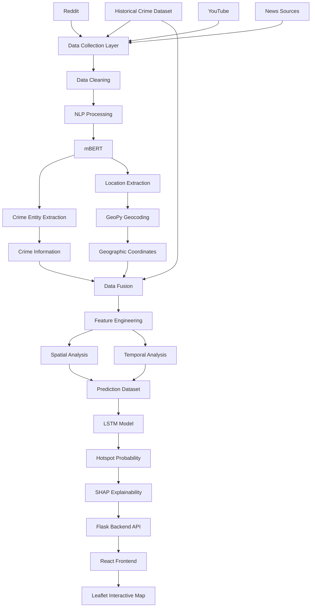

---

# 12. Complete System Flow

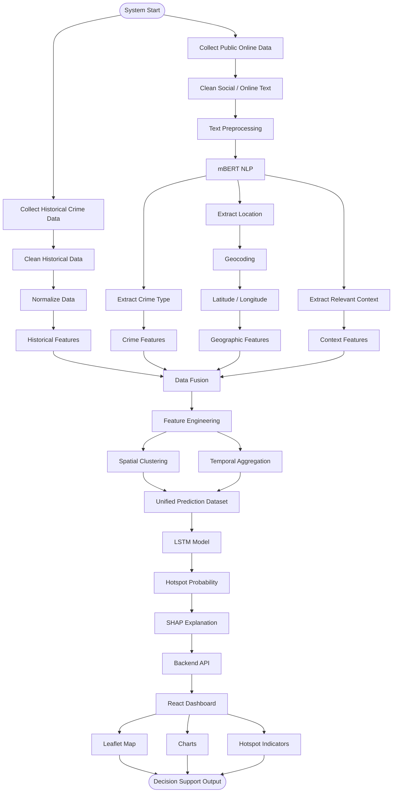

---

# 13. Data Flow Diagram

## Level 0 — Context Diagram

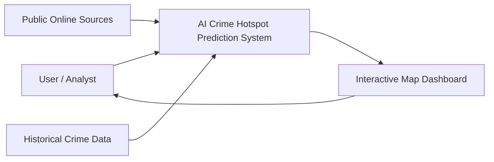

---

## Level 1 — Data Processing

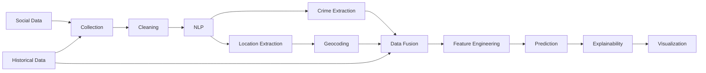

---

## Level 2 — Prediction Flow

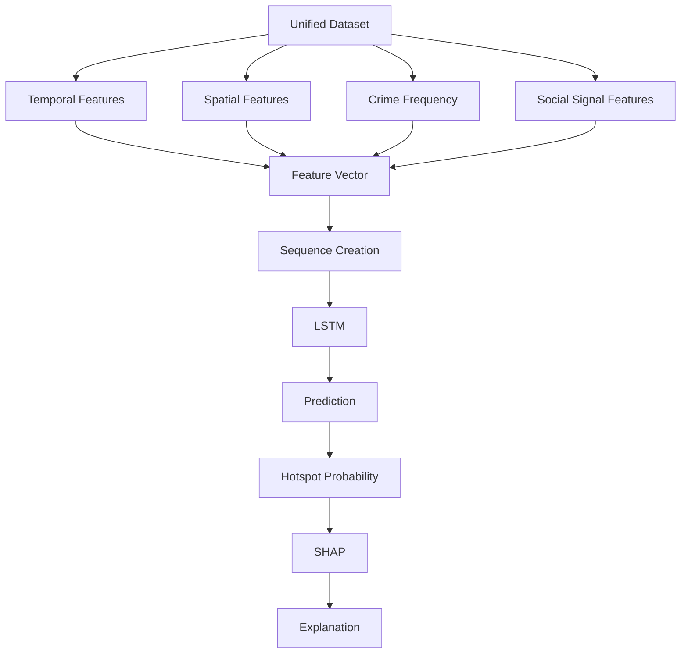

---

# 14. Detailed Processing Pipeline

The complete processing pipeline can be represented as:

```text
DATA SOURCES
     │
     ▼
DATA INGESTION
     │
     ▼
DATA CLEANING
     │
     ▼
TEXT PREPROCESSING
     │
     ▼
NLP / mBERT
     │
     ├───────────────┐
     ▼               ▼
Crime Type       Location
     │               │
     │               ▼
     │           Geocoding
     │               │
     └───────┬───────┘
             ▼
       DATA FUSION
             │
             ▼
     FEATURE ENGINEERING
             │
       ┌─────┴─────┐
       ▼           ▼
    Spatial      Temporal
    Analysis     Analysis
       │           │
       └─────┬─────┘
             ▼
        LSTM MODEL
             │
             ▼
     HOTSPOT PROBABILITY
             │
             ▼
       SHAP EXPLANATION
             │
             ▼
         FLASK API
             │
             ▼
      REACT DASHBOARD
             │
             ▼
       LEAFLET MAP
```

---

# 15. Module 1 — Data Collection

## Data Sources

The architecture supports:

* Historical crime datasets
* Reddit
* YouTube
* NewsAPI
* Other permitted public information sources

---

## Historical Data

Historical data provides the baseline crime distribution.

Possible attributes include:

```text
Date
Time
Crime Type
Location
Latitude
Longitude
Area
District
Frequency
```

The actual schema depends on the dataset used.

---

## Public Online Data

Public textual information may contain:

```text
Post title
Post body
Timestamp
Source
Location mention
Crime-related terms
Context
```

---

## Why Multiple Sources?

Different sources provide different types of information.

```text
Historical Dataset
      │
      ├── Long-term patterns
      ├── Historical frequency
      └── Geographic distribution

Social / Online Data
      │
      ├── Recent signals
      ├── Unstructured context
      └── Emerging activity

             ↓

       Combined Analysis
```

---

# 16. Module 2 — Social Media Processing

Raw social media data is not directly suitable for machine learning.

It may contain:

* Irrelevant posts
* Spam
* Duplicates
* Advertisements
* Sarcasm
* Opinions
* False information
* Missing locations
* Ambiguous locations

Therefore, preprocessing is required.

---

## Processing Steps

```text
Raw Text
   ↓
Remove Noise
   ↓
Normalize Text
   ↓
Tokenization
   ↓
Language Processing
   ↓
Crime Relevance Detection
   ↓
Entity Extraction
```

---

# 17. Module 3 — NLP Using mBERT

## What is mBERT?

mBERT stands for:

**Multilingual Bidirectional Encoder Representations from Transformers**

It is a multilingual transformer-based language model.

The project can use mBERT to process textual information across multiple languages and identify relevant entities.

---

## Example

### Input

```text
"Multiple phone thefts reported near Connaught Place tonight."
```

### NLP Output

```json
{
  "crime_type": "theft",
  "location": "Connaught Place",
  "time_context": "tonight"
}
```

---

## NLP Flow

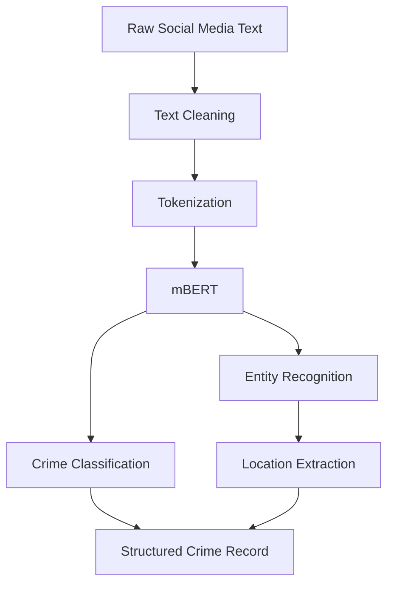

---

# 18. Module 4 — Location Extraction

Location information is essential for hotspot analysis.

Examples:

```text
Bangalore
Connaught Place
Hyderabad
Whitefield
Koramangala
Delhi
Mumbai
```

The NLP component attempts to identify location entities from text.

---

## Location Processing

```text
Text
 ↓
Named Entity Recognition
 ↓
Location Entity
 ↓
Normalization
 ↓
Geocoding
```

---

# 19. Module 5 — Geocoding Using GeoPy

GeoPy provides an interface for geocoding services.

The purpose is to convert:

```text
Place Name
```

into:

```text
Latitude
Longitude
```

---

## Example

```text
Bangalore
     ↓
12.9716
77.5946
```

The exact coordinate returned depends on the geocoding provider and query.

---

## Geocoding Flow

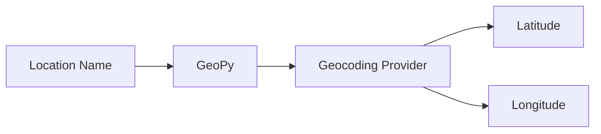

---

# 20. Module 6 — Data Fusion

Data fusion combines information from different sources.

```text
Historical Data
      +
NLP Extracted Data
      +
Geographic Data
      +
Temporal Data
      ↓
Unified Analytical Dataset
```

---

## Example Unified Record

```json
{
  "crime_type": "theft",
  "location": "Connaught Place",
  "latitude": 28.6139,
  "longitude": 77.2090,
  "timestamp": "2026-09-28T21:00:00",
  "source": "public_online",
  "historical_frequency": 42
}
```

The actual schema should match the implementation.

---

# 21. Module 7 — Feature Engineering

Machine learning models require numerical features.

Potential features include:

### Temporal Features

```text
Hour
Day
Day of Week
Week
Month
Year
```

### Spatial Features

```text
Latitude
Longitude
Cluster ID
Distance from hotspot
Area
```

### Crime Features

```text
Crime frequency
Crime category
Recent crime count
Historical crime count
```

### Social Signal Features

```text
Recent post count
Crime-related post frequency
Source count
Time since latest signal
```

---

## Feature Engineering Flow

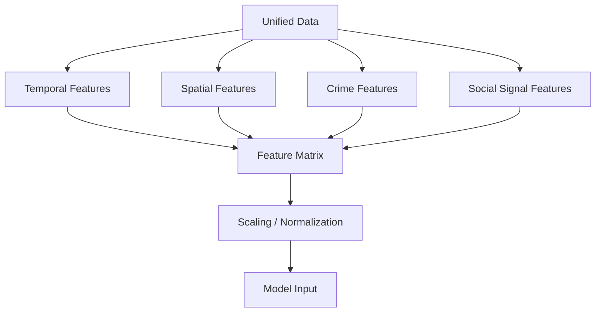

---

# 22. Module 8 — Spatial Clustering

Spatial clustering can be used to identify geographic areas where crime-related records are concentrated.

One possible method is:

**DBSCAN — Density-Based Spatial Clustering of Applications with Noise**

---

## Why DBSCAN?

DBSCAN is useful for geographic data because:

* It does not require a predefined number of clusters.
* It can identify dense regions.
* It can classify isolated observations as noise.
* It can work with irregularly shaped clusters.

---

## Concept

```text
Individual Crime Events
        │
        ▼
Spatial Coordinates
        │
        ▼
Density Analysis
        │
        ├── Dense Region
        │
        ├── Another Dense Region
        │
        └── Noise / Outlier
```

---

# 23. Module 9 — LSTM Prediction

## What is LSTM?

LSTM stands for:

**Long Short-Term Memory**

It is a type of recurrent neural network designed to learn patterns from sequential data.

---

## Why LSTM?

Crime activity may contain temporal patterns.

For example:

```text
Monday → Low
Tuesday → Medium
Wednesday → Medium
Thursday → High
Friday → Very High
```

A sequential model can learn relationships across time steps.

---

## LSTM Pipeline

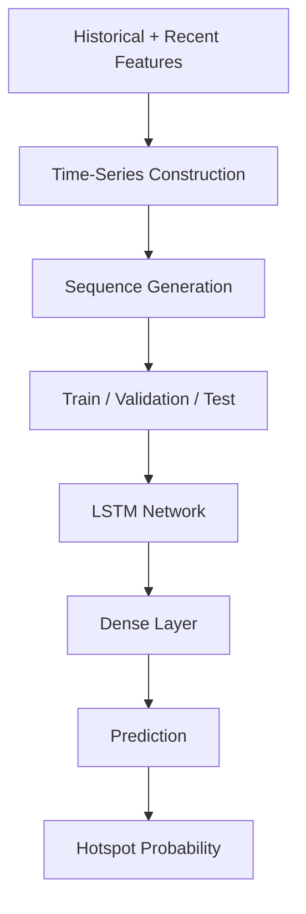

---

## Conceptual Model

```text
Input Sequence
     │
     ▼
┌──────────────┐
│ LSTM Layer   │
└──────────────┘
     │
     ▼
┌──────────────┐
│ LSTM Layer   │
└──────────────┘
     │
     ▼
┌──────────────┐
│ Dense Layer  │
└──────────────┘
     │
     ▼
Hotspot Score
```

---

# 24. Module 10 — Explainable AI Using SHAP

Machine-learning predictions should ideally be interpretable.

SHAP provides a framework for estimating the contribution of input features toward a model output.

---

## Example

Suppose the system predicts:

```text
Hotspot Probability = 0.85
```

Potential contributing factors might include:

```text
Recent theft activity       ↑
Historical crime frequency  ↑
Recent social signals       ↑
Time-based activity         ↑
Spatial density             ↑
```

The exact contribution must be calculated from the trained model rather than assumed.

---

## SHAP Concept

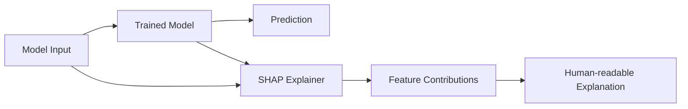

---

# 25. Module 11 — Flask Backend

Flask acts as the backend service layer.

The backend can provide APIs for:

* Crime data
* Predictions
* Locations
* Hotspots
* Model outputs
* Explanations
* Dashboard data

---

## Backend Architecture

```text
React Frontend
      │
      │ HTTP / REST
      ▼
Flask Backend
      │
      ├── Data Processing
      ├── NLP
      ├── Prediction
      ├── SHAP
      └── Database / Files
```

---

# 26. Module 12 — React Frontend

React.js is used to build the interactive user interface.

Potential dashboard components include:

* Map
* Heatmap
* Crime filters
* Date filters
* Crime categories
* Prediction indicators
* Statistics
* Explanation panels

---

# 27. Module 13 — Leaflet Visualization

Leaflet.js provides interactive maps.

The dashboard can visualize:

* Crime events
* Hotspots
* Cluster areas
* Predicted regions
* Geographic boundaries
* Heatmaps

---

## Map Flow

```text
Prediction
    ↓
Latitude / Longitude
    ↓
GeoJSON / Map Data
    ↓
Leaflet
    ↓
Interactive Visualization
```

---

# 28. End-to-End Example

Consider the following public text:

> "Multiple phone thefts reported near Connaught Place tonight."

---

## Step 1 — Input

```text
Multiple phone thefts reported near Connaught Place tonight.
```

---

## Step 2 — NLP

The NLP layer extracts:

```text
Crime Type = Theft
Location = Connaught Place
Time Context = Tonight
```

---

## Step 3 — Geocoding

The location is converted into geographic coordinates.

```text
Connaught Place
       ↓
Latitude
Longitude
```

---

## Step 4 — Historical Integration

Historical crime information for the relevant geographic region is retrieved.

---

## Step 5 — Feature Engineering

Features may include:

```text
Recent theft frequency
Historical theft frequency
Time
Location
Spatial density
Recent public signals
```

---

## Step 6 — Prediction

The sequence model generates a hotspot prediction score.

Example only:

```text
Hotspot Probability = 0.85
```

This number is illustrative and should not be interpreted as an actual project result unless produced by the trained model.

---

## Step 7 — Explainability

SHAP is used to determine which model features contributed to the output.

---

## Step 8 — Visualization

The result is displayed on the interactive map.

```text
                    MAP

       ┌───────────────────────────┐
       │                           │
       │        🟢                 │
       │                           │
       │              🟠           │
       │                           │
       │                    🔴     │
       │                           │
       └───────────────────────────┘
```

---

# 29. System Sequence Diagram

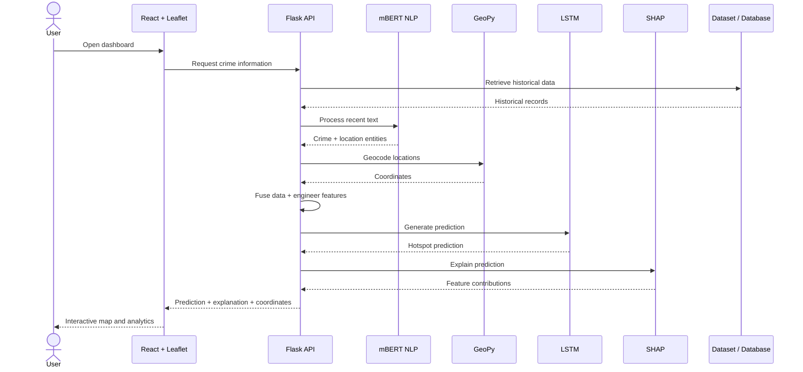

---

# 30. Component Diagram

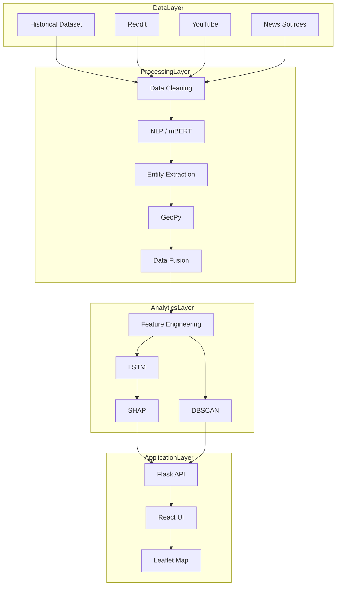

---

# 31. Deployment Architecture

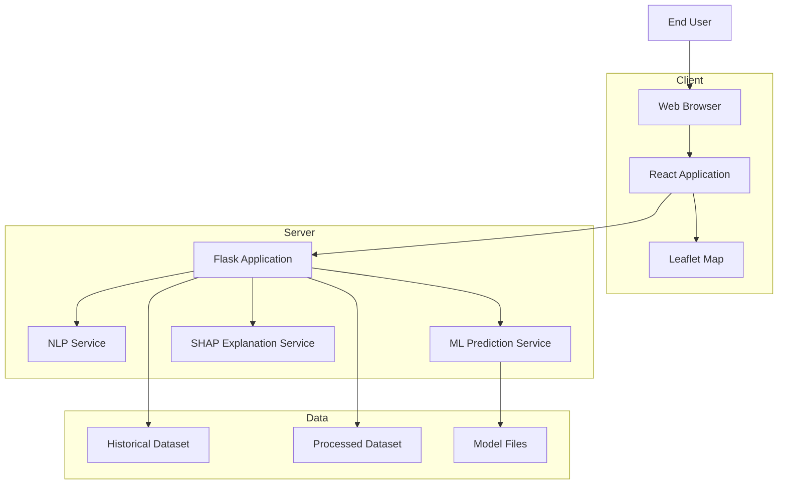

---

# 32. Database/Data Model

The exact database structure depends on implementation.

A conceptual model may contain the following entities:

```text
Crime Event
───────────
event_id
crime_type
timestamp
location
latitude
longitude
source
```

```text
Location
────────
location_id
name
latitude
longitude
area
district
```

```text
Social Signal
─────────────
signal_id
source
text
timestamp
location
crime_type
```

```text
Prediction
──────────
prediction_id
location
timestamp
probability
model_version
```

```text
Explanation
───────────
explanation_id
prediction_id
feature
contribution
```

---

## Conceptual ER Diagram

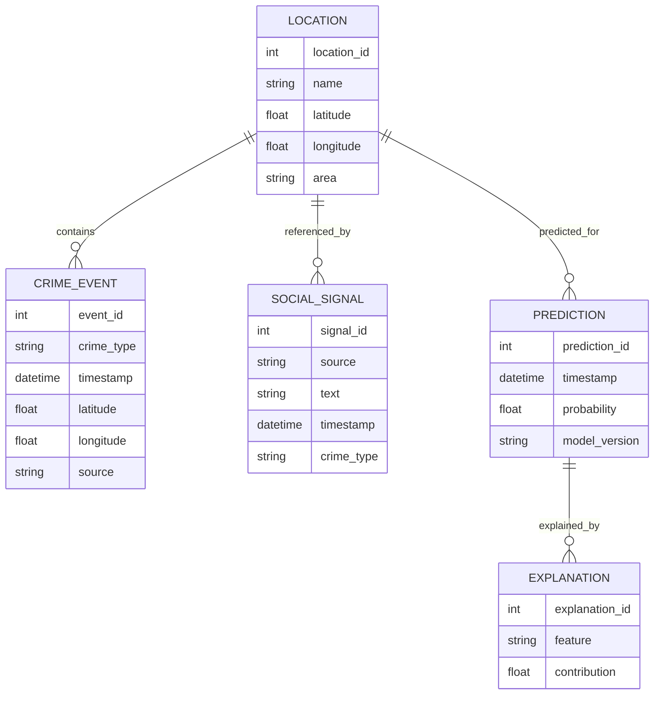

---

# 33. Machine Learning Pipeline

```text
Historical Data
      │
      ▼
Data Cleaning
      │
      ▼
Feature Engineering
      │
      ▼
Temporal Aggregation
      │
      ▼
Spatial Aggregation
      │
      ▼
Sequence Generation
      │
      ▼
Training Data
      │
      ├──────────────┐
      ▼              ▼
Validation        Testing
      │              │
      └──────┬───────┘
             ▼
        LSTM Model
             │
             ▼
        Evaluation
             │
             ▼
       Saved Model
```

---

# 34. NLP Pipeline

```text
Raw Text
   ↓
Language Detection / Normalization
   ↓
Text Cleaning
   ↓
Tokenization
   ↓
mBERT
   ↓
Named Entity Recognition
   ↓
Crime Entity
   +
Location Entity
   +
Temporal Context
   ↓
Structured Record
```

---

# 35. Prediction Pipeline

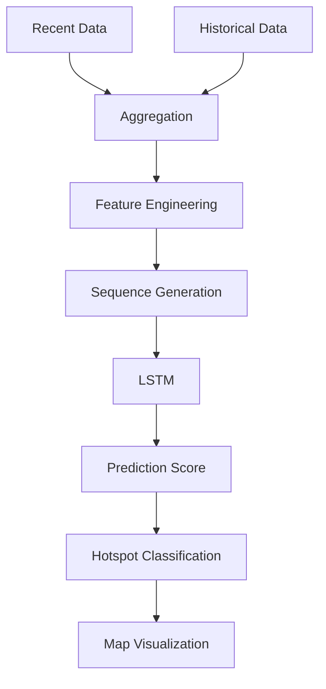

---

# 36. Explainability Pipeline

```text
Input Features
      │
      ▼
Trained Model
      │
      ▼
Prediction
      │
      ▼
SHAP Explainer
      │
      ▼
Feature Contributions
      │
      ▼
Explanation
      │
      ▼
Dashboard
```

---

# 37. Technology Stack

| Layer              | Technology            |
| ------------------ | --------------------- |
| Frontend           | React.js              |
| Mapping            | Leaflet.js            |
| Backend            | Flask                 |
| NLP                | mBERT                 |
| Prediction         | LSTM                  |
| Spatial Clustering | DBSCAN                |
| Explainability     | SHAP                  |
| Geocoding          | GeoPy                 |
| Data Processing    | Python                |
| Data Format        | CSV / JSON / Database |
| Version Control    | Git / GitHub          |

---

# 38. Why These Technologies?

## React.js

Used for building a dynamic web interface.

## Leaflet.js

Used for interactive geographic visualization.

## Flask

Provides a lightweight Python backend for exposing APIs and integrating ML components.

## mBERT

Provides multilingual transformer-based language understanding.

## LSTM

Suitable for modeling sequential temporal patterns.

## DBSCAN

Useful for density-based spatial analysis.

## SHAP

Provides feature-level model explanations.

## GeoPy

Provides geocoding functionality.

---

# 39. Repository Structure

A recommended structure is:

```text
AI-Crime-Hotspot-Prediction/
│
├── README.md
├── LICENSE
├── .gitignore
├── requirements.txt
├── .env.example
│
├── backend/
│   ├── app.py
│   ├── routes/
│   ├── services/
│   ├── models/
│   ├── utils/
│   └── config/
│
├── frontend/
│   ├── package.json
│   ├── src/
│   ├── public/
│   └── components/
│
├── data/
│   ├── raw/
│   ├── processed/
│   └── sample/
│
├── models/
│   ├── nlp/
│   ├── lstm/
│   └── clustering/
│
├── notebooks/
│   ├── data_analysis/
│   ├── preprocessing/
│   ├── training/
│   └── evaluation/
│
├── scripts/
│   ├── data_collection/
│   ├── preprocessing/
│   ├── training/
│   └── inference/
│
├── tests/
│   ├── test_api/
│   ├── test_nlp/
│   ├── test_prediction/
│   └── test_utils/
│
├── docs/
│   ├── architecture/
│   ├── diagrams/
│   ├── research/
│   └── screenshots/
│
└── assets/
    ├── images/
    ├── screenshots/
    └── diagrams/
```

> Adapt this structure to the actual files in the repository. Do not create empty directories merely to match the documentation.

---

# 40. Installation

## Prerequisites

Recommended environment:

```text
Python 3.x
Node.js
npm
Git
Modern Web Browser
```

---

## Clone Repository

```bash
git clone https://github.com/AkramKhan543719/AI-Crime-Hotspot-Prediction.git
```

```bash
cd AI-Crime-Hotspot-Prediction
```

---

# 41. Backend Setup

Create a virtual environment:

```bash
python -m venv venv
```

### Windows

```powershell
venv\Scripts\activate
```

### Linux / macOS

```bash
source venv/bin/activate
```

Install dependencies:

```bash
pip install -r requirements.txt
```

---

# 42. Frontend Setup

Navigate to the frontend:

```bash
cd frontend
```

Install dependencies:

```bash
npm install
```

Return to project root:

```bash
cd ..
```

---

# 43. Configuration

Create an environment file:

```text
.env
```

Never commit the actual `.env` file to GitHub.

Use:

```text
.env.example
```

instead.

---

# 44. Environment Variables

Example:

```env
FLASK_ENV=development
FLASK_DEBUG=True

DATABASE_URL=your_database_url

REDDIT_CLIENT_ID=your_client_id
REDDIT_CLIENT_SECRET=your_client_secret

NEWS_API_KEY=your_news_api_key

GEOCODING_USER_AGENT=your_application_name
```

Use only the variables actually required by your implementation.

---

# 45. API-Key Security

## ⚠️ IMPORTANT

Never commit:

```text
API keys
Passwords
Tokens
Client secrets
Private credentials
.env files
```

to a public GitHub repository.

---

## Correct Approach

```text
.env
   ↓
Local Environment Variables
   ↓
Application
```

GitHub should contain:

```text
.env.example
```

not:

```text
.env
```

---

## `.gitignore`

Recommended:

```gitignore
.env
.env.*
!.env.example

venv/
.venv/

__pycache__/
*.pyc

node_modules/

*.log

.DS_Store

.vscode/
.idea/

*.sqlite3

secrets/
credentials/
```

---

# 46. Running the Project

## Backend

Example:

```bash
python app.py
```

or:

```bash
flask run
```

Use the actual startup command implemented in the project.

---

## Frontend

```bash
cd frontend
npm start
```

or:

```bash
npm run dev
```

depending on the frontend configuration.

---

# 47. Backend API

The backend may expose endpoints similar to:

| Endpoint         | Method | Purpose                         |
| ---------------- | ------ | ------------------------------- |
| `/api/health`    | GET    | Health check                    |
| `/api/crimes`    | GET    | Retrieve crime records          |
| `/api/hotspots`  | GET    | Retrieve hotspot information    |
| `/api/predict`   | POST   | Generate prediction             |
| `/api/explain`   | POST   | Generate explanation            |
| `/api/locations` | GET    | Retrieve geographic information |

The actual endpoints should match the implementation.

---

# 48. API Workflow

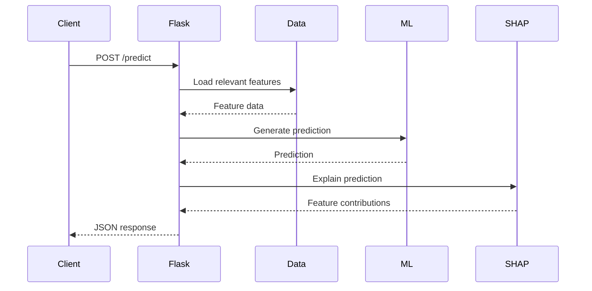

---

# 49. Input and Output

## Example Input

```json
{
  "location": "Connaught Place",
  "crime_type": "theft",
  "timestamp": "2026-09-28T21:00:00"
}
```

---

## Example Output

```json
{
  "location": "Connaught Place",
  "prediction": 0.85,
  "status": "high",
  "explanation": {
    "recent_activity": 0.31,
    "historical_frequency": 0.24,
    "spatial_density": 0.18
  }
}
```

The above values are illustrative examples only.

---

# 50. Example Prediction

Suppose the model receives:

```text
Crime Type:
Theft

Location:
Connaught Place

Recent Activity:
High

Historical Frequency:
High

Time:
Night
```

The model processes the available features and generates a prediction.

```text
Input
  ↓
Feature Vector
  ↓
LSTM
  ↓
Prediction Score
  ↓
SHAP
  ↓
Explanation
  ↓
Map
```

---

# 51. Dashboard

The dashboard is designed to provide a geographic overview of crime-related patterns.

Potential dashboard components:

### Map

Displays:

* Crime locations
* Hotspot regions
* Clusters
* Predicted areas

### Filters

Possible filters:

```text
Crime Type
Date
Time
Area
Prediction Level
Source
```

### Analytics

Potential indicators:

```text
Total Records
Recent Crime Signals
Active Hotspots
Predicted Hotspots
Crime Categories
```

---

# 52. Visualization Strategy

## Heatmap

A heatmap can represent crime density.

```text
Low Density
     ↓
Medium Density
     ↓
High Density
```

## Marker Visualization

Each marker can represent an event or geographic observation.

## Cluster Visualization

Clusters can represent dense geographic regions.

## Prediction Visualization

Predicted hotspot areas can be displayed separately from historical observations to avoid confusing past observations with future predictions.

---

# 53. Explainability

Explainability is one of the major components of the system.

Instead of displaying only:

```text
Prediction = 0.85
```

the system attempts to provide:

```text
Why did the model produce this prediction?
```

Potential factors may include:

* Historical crime frequency
* Recent activity
* Spatial density
* Time-related patterns
* Crime category
* Recent social signals

The actual feature importance must come from the trained model and SHAP analysis.

---

# 54. Advantages

## 1. Multi-source Analysis

Combines multiple information sources.

## 2. Near-Real-Time Signals

Recent public information can complement historical datasets.

## 3. NLP-Based Processing

Unstructured text can be converted into structured information.

## 4. Spatial Analysis

Geographic concentration can be analyzed.

## 5. Temporal Modeling

Sequential patterns can be modeled.

## 6. Explainability

SHAP provides an approach for understanding model outputs.

## 7. Interactive Visualization

Users can explore geographic patterns through maps.

## 8. Modular Design

Individual components can be independently improved.

---

# 55. Limitations

The system has important limitations.

## Data Quality

Public online information may be noisy or inaccurate.

## False Reports

Not every online report represents a verified incident.

## Location Ambiguity

A location mentioned in a post may not represent the actual incident location.

## Reporting Bias

Social media usage varies across populations and geographic regions.

## Model Bias

Machine-learning models can reproduce biases present in training data.

## API Limitations

External services may impose:

* Rate limits
* Availability restrictions
* Authentication requirements

## Prediction Uncertainty

A model prediction is not a guarantee that a crime will occur.

---

# 56. Challenges

Major engineering and research challenges include:

### Challenge 1

Collecting heterogeneous data.

### Challenge 2

Cleaning unstructured text.

### Challenge 3

Extracting accurate locations.

### Challenge 4

Handling multilingual text.

### Challenge 5

Converting textual locations to geographic coordinates.

### Challenge 6

Combining historical and real-time data.

### Challenge 7

Building meaningful temporal sequences.

### Challenge 8

Avoiding overfitting.

### Challenge 9

Interpreting model predictions.

### Challenge 10

Visualizing complex geographic information.

---

# 57. Data Quality Considerations

Before data enters the prediction pipeline, it should ideally undergo validation.

```text
Raw Record
    ↓
Is Text Valid?
    ↓
Is Crime Relevant?
    ↓
Is Location Available?
    ↓
Can Location Be Geocoded?
    ↓
Is Timestamp Valid?
    ↓
Remove Duplicate?
    ↓
Validated Record
```

---

# 58. Privacy and Security

The project should follow responsible data-handling practices.

Recommended principles:

* Collect only necessary information.
* Avoid storing unnecessary personally identifiable information.
* Do not expose private user information.
* Follow applicable platform terms.
* Use public data responsibly.
* Protect API credentials.
* Avoid publishing sensitive raw datasets.
* Secure backend endpoints.
* Validate user input.

---

# 59. Ethical Considerations

Crime prediction is a sensitive application area.

The system should **not** be interpreted as predicting that a particular person will commit a crime.

The project focuses on:

```text
Geographic patterns
+
Temporal patterns
+
Aggregated crime-related signals
```

rather than individual-level criminal profiling.

---

# 60. Responsible Use

The system is intended as:

> **A research and decision-support platform for analyzing crime-related spatio-temporal patterns.**

It should not independently determine:

* Arrests
* Searches
* Surveillance targets
* Individual guilt
* Individual criminality
* Law-enforcement action

Human review and independent verification are essential.

---

# 61. Applications

## 🚓 1. Law Enforcement Decision Support

Potential applications include:

* Patrol planning
* Resource allocation
* Situational awareness

The output should be treated as supplementary information rather than definitive evidence.

---

## 🏙️ 2. Smart City Analytics

The system can potentially support urban safety analytics.

---

## 📊 3. Government Analysis

Aggregated patterns may help identify areas requiring further investigation or infrastructure analysis.

---

## 🚑 4. Emergency Response

Recent geographic signals may provide supplementary situational awareness.

---

## 🎓 5. Academic Research

The project provides a framework for research in:

* NLP
* Machine Learning
* GIS
* Explainable AI
* Spatio-temporal prediction

---

# 62. Future Enhancements

## 1. Computer Vision

Integrate CCTV/video analytics.

Potential technologies:

```text
YOLO
OpenCV
Object Detection
Object Tracking
```

---

## 2. Mobile Application

Build Android/iOS applications for authorized users.

---

## 3. Advanced Geolocation

Improve location extraction using:

* Contextual NLP
* Geographic knowledge graphs
* Entity linking

---

## 4. Improved Models

Explore:

* Transformers
* Temporal Transformers
* GRU
* CNN-LSTM
* Graph Neural Networks
* Spatio-temporal Transformers

---

## 5. Real-Time Streaming

Integrate streaming architectures such as:

```text
Kafka
Redis Streams
WebSockets
```

where appropriate.

---

## 6. Advanced GIS

Integrate:

* GeoJSON
* PostGIS
* Spatial indexes
* Geographic boundaries

---

## 7. Multimodal Crime Signals

Combine:

```text
Text
+
Images
+
Video
+
Geospatial Data
+
Historical Data
```

---

# 63. Research Scope

The project provides opportunities for research in:

### Natural Language Processing

Extracting crime-related entities from multilingual text.

### Machine Learning

Predicting sequential patterns.

### Spatial Intelligence

Identifying geographic clusters.

### Explainable AI

Understanding model behavior.

### Social Computing

Studying public online signals.

### Smart Cities

Using AI for urban analytics.

---

# 64. Testing Strategy

Testing should cover every major component.

## Unit Testing

Test individual functions.

Examples:

```text
Location parser
Date parser
Feature generator
API utility
Prediction function
```

---

## Integration Testing

Test interactions between:

```text
NLP → Geocoding
Geocoding → Data Fusion
Data Fusion → Model
Model → SHAP
Backend → Frontend
```

---

## API Testing

Test:

* Valid requests
* Invalid requests
* Missing parameters
* Invalid locations
* Empty datasets
* Model failures

---

## UI Testing

Verify:

* Map loading
* Filters
* Markers
* Heatmaps
* API errors
* Responsive layout

---

# 65. Performance Considerations

Potential optimization areas:

### NLP

Cache repeated text processing where appropriate.

### Geocoding

Cache geocoding results to reduce repeated external requests.

### Database

Use indexes for:

```text
Timestamp
Latitude
Longitude
Crime Type
```

### ML

Load trained models once rather than repeatedly loading model files per request.

### Frontend

Avoid rendering thousands of map markers simultaneously.

---

# 66. Error Handling

Potential errors include:

```text
Invalid API key
Network failure
Rate limit exceeded
Invalid location
Missing coordinates
Malformed input
Model unavailable
Empty dataset
```

A robust system should return meaningful error messages.

---

# 67. Reproducibility

To make the project reproducible:

1. Document Python version.
2. Document package versions.
3. Maintain `requirements.txt`.
4. Provide `.env.example`.
5. Document dataset sources.
6. Document preprocessing.
7. Document model training.
8. Document inference.
9. Document frontend setup.
10. Avoid hardcoded machine-specific paths.

---

# 68. Security Checklist

Before publishing the repository:

* [ ] Remove API keys
* [ ] Remove passwords
* [ ] Remove tokens
* [ ] Remove `.env`
* [ ] Check Git history for leaked credentials
* [ ] Add `.gitignore`
* [ ] Remove personal absolute paths
* [ ] Remove private datasets
* [ ] Remove unnecessary personal information
* [ ] Verify public API usage permissions
* [ ] Verify third-party licenses

---

# 69. Development Workflow


---

# 70. GitHub Workflow

Recommended workflow:

```text
Local Project
     ↓
Git Init
     ↓
Git Add
     ↓
Git Commit
     ↓
Git Remote
     ↓
Git Push
     ↓
GitHub Repository
```

---

## Example

```bash
git init
```

```bash
git add .
```

```bash
git commit -m "Initial project release"
```

```bash
git branch -M main
```

```bash
git remote add origin https://github.com/AkramKhan543719/AI-Crime-Hotspot-Prediction.git
```

```bash
git push -u origin main
```

---

# 71. Documentation

Recommended project documentation:

```text
README.md
│
├── Architecture
├── Data Flow
├── ML Pipeline
├── NLP Pipeline
├── API Documentation
├── Installation
├── Configuration
├── Testing
├── Security
├── Ethics
└── Future Scope
```

---

# 72. Project Timeline

The project was developed as a long-term academic project.

A typical development progression is:

```text
Phase 1
Requirement Analysis
        ↓
Phase 2
Literature / Problem Study
        ↓
Phase 3
Dataset Collection
        ↓
Phase 4
Data Preprocessing
        ↓
Phase 5
NLP Development
        ↓
Phase 6
Geolocation
        ↓
Phase 7
Machine Learning
        ↓
Phase 8
Explainable AI
        ↓
Phase 9
Backend
        ↓
Phase 10
Frontend + Mapping
        ↓
Phase 11
Integration
        ↓
Phase 12
Testing + Documentation
```

---

# 73. Academic Contribution

The project demonstrates the integration of multiple computer-science disciplines:

```text
Artificial Intelligence
        +
Machine Learning
        +
Natural Language Processing
        +
Geospatial Computing
        +
Time-Series Analysis
        +
Explainable AI
        +
Web Development
        +
Data Visualization
```

This makes the project a multidisciplinary AI application rather than a standalone machine-learning model.

---

# 74. Project Novelty

The project combines several components into a single pipeline:

### 1. Public Online Signals

Recent public information can complement historical crime records.

### 2. Multilingual NLP

mBERT can process multilingual text.

### 3. Geospatial Intelligence

Textual locations are converted into geographic information.

### 4. Spatio-Temporal Modeling

Both geographic and temporal patterns are considered.

### 5. Explainable AI

SHAP can provide feature-level explanations.

### 6. Interactive Visualization

Results are displayed through an interactive geographic dashboard.

---

# 75. Viva Explanation

## Explain the project in one sentence

> "Our project uses NLP, geospatial analysis, historical crime data and machine learning to identify and explain emerging crime hotspot patterns through an interactive map."

---

## Explain the project in 30 seconds

> "The system combines historical crime data with recent crime-related information from public online sources. NLP techniques such as mBERT extract crime categories and locations from unstructured text. GeoPy converts locations into coordinates, after which the data is fused with historical information. Spatial and temporal features are then used by an LSTM-based model to estimate hotspot probabilities. SHAP provides explanations for the model output, and the results are visualized through a React and Leaflet dashboard."

---

## Explain the project in 2 minutes

> "The main objective of our project is to explore how AI can combine historical crime information with recent public online signals to identify emerging geographic crime patterns.
>
> The system starts by collecting historical crime data and crime-related textual information from permitted public sources such as Reddit, YouTube and news sources. Since online data is unstructured, it first goes through preprocessing and NLP.
>
> We use a multilingual transformer model such as mBERT to identify crime-related entities and locations. Once a location is extracted, GeoPy is used to convert the textual location into latitude and longitude.
>
> These records are then combined with historical crime data. We perform feature engineering to generate temporal features such as hour, day and month, along with spatial features such as geographic coordinates and density-related information.
>
> Spatial clustering can be performed using DBSCAN to identify dense geographic regions. For sequential temporal patterns, an LSTM model is used to generate hotspot predictions.
>
> Since machine-learning predictions should not be treated as black boxes, SHAP is used to analyze feature contributions and explain why a prediction was generated.
>
> Finally, the Flask backend exposes the processed information and predictions to the React frontend. Leaflet is used to display crime patterns and predicted hotspots on an interactive map.
>
> The overall objective is to create an AI-based decision-support and research platform that combines real-time signals, historical data, machine learning and explainable visualization."

---

# 76. Frequently Asked Questions

## Q1. Why use social media data?

Because public online information may contain recent signals that are not immediately present in historical structured datasets.

---

## Q2. Is every social media post considered a crime?

No.

Social media data is noisy and should be treated as an unverified signal requiring filtering and validation.

---

## Q3. Why use mBERT?

mBERT is designed for multilingual language understanding and can help process textual information across multiple languages.

---

## Q4. Why use GeoPy?

GeoPy provides geocoding functionality that can convert textual locations into geographic coordinates.

---

## Q5. Why use DBSCAN?

DBSCAN is a density-based clustering algorithm that can identify geographic concentrations without requiring a predefined number of clusters.

---

## Q6. Why use LSTM?

LSTM can model sequential dependencies and is therefore useful for temporal patterns.

---

## Q7. Why use SHAP?

SHAP provides a framework for explaining model predictions through feature contributions.

---

## Q8. Why use React?

React provides a component-based framework for building an interactive frontend.

---

## Q9. Why use Leaflet?

Leaflet is lightweight and well suited for interactive geographic visualization.

---

## Q10. Why use Flask?

Flask provides a lightweight Python backend that can integrate naturally with Python-based NLP and machine-learning components.

---

## Q11. Can the system guarantee that a crime will happen?

No.

A prediction is probabilistic and should not be interpreted as a guarantee.

---

## Q12. Can the system identify criminals?

No.

The project is designed around geographic and temporal patterns rather than identifying individuals.

---

## Q13. What are the major challenges?

The major challenges include:

* Noisy online data
* Location ambiguity
* Data bias
* Multilingual text
* Geocoding limitations
* API limitations
* Prediction uncertainty
* Privacy concerns

---

## Q14. What makes the project different?

The project integrates:

```text
Real-time public signals
+
Historical crime data
+
NLP
+
Geospatial analysis
+
LSTM
+
SHAP
+
Interactive maps
```

into a single analytical pipeline.

---

# 77. Glossary

| Term   | Meaning                                                     |
| ------ | ----------------------------------------------------------- |
| AI     | Artificial Intelligence                                     |
| ML     | Machine Learning                                            |
| NLP    | Natural Language Processing                                 |
| mBERT  | Multilingual BERT                                           |
| LSTM   | Long Short-Term Memory                                      |
| SHAP   | SHapley Additive exPlanations                               |
| DBSCAN | Density-Based Spatial Clustering of Applications with Noise |
| GIS    | Geographic Information System                               |
| API    | Application Programming Interface                           |
| REST   | Representational State Transfer                             |
| NER    | Named Entity Recognition                                    |
| ETL    | Extract, Transform, Load                                    |
| UI     | User Interface                                              |
| JSON   | JavaScript Object Notation                                  |
| CSV    | Comma-Separated Values                                      |

---

# 78. Future Research Directions

Future research can investigate:

### Advanced Spatio-Temporal Models

```text
Graph Neural Networks
Temporal Transformers
Spatio-Temporal Transformers
```

### Multimodal Intelligence

```text
Text
Images
Video
Geographic Data
Temporal Data
```

### Better Location Understanding

```text
NER
Entity Linking
Geographic Knowledge Graphs
Contextual Geocoding
```

### Streaming Architecture

```text
Kafka
Redis
WebSockets
Real-time event pipelines
```

### Advanced Explainability

Research can explore:

```text
SHAP
LIME
Counterfactual Explanations
Feature Attribution
```

---

# 79. System Summary

The complete project can be summarized as:

```text
                 ┌─────────────────────┐
                 │ Historical Crime    │
                 │ Data                │
                 └──────────┬──────────┘
                            │
                            │
                 ┌──────────▼──────────┐
                 │ Public Online Data  │
                 │ Reddit / News etc.  │
                 └──────────┬──────────┘
                            │
                            ▼
                 ┌─────────────────────┐
                 │ Data Collection     │
                 └──────────┬──────────┘
                            │
                            ▼
                 ┌─────────────────────┐
                 │ Data Cleaning       │
                 └──────────┬──────────┘
                            │
                            ▼
                 ┌─────────────────────┐
                 │ mBERT NLP           │
                 │ Crime + Location    │
                 └──────────┬──────────┘
                            │
                            ▼
                 ┌─────────────────────┐
                 │ GeoPy Geocoding     │
                 └──────────┬──────────┘
                            │
                            ▼
                 ┌─────────────────────┐
                 │ Data Fusion         │
                 └──────────┬──────────┘
                            │
                            ▼
                 ┌─────────────────────┐
                 │ Feature Engineering │
                 └──────────┬──────────┘
                            │
                  ┌─────────┴─────────┐
                  ▼                   ▼
        ┌─────────────────┐   ┌─────────────────┐
        │ Spatial         │   │ Temporal        │
        │ Analysis        │   │ Analysis        │
        └────────┬────────┘   └────────┬────────┘
                 │                     │
                 └──────────┬──────────┘
                            ▼
                 ┌─────────────────────┐
                 │ LSTM Prediction     │
                 └──────────┬──────────┘
                            │
                            ▼
                 ┌─────────────────────┐
                 │ Hotspot Probability │
                 └──────────┬──────────┘
                            │
                            ▼
                 ┌─────────────────────┐
                 │ SHAP Explainability │
                 └──────────┬──────────┘
                            │
                            ▼
                 ┌─────────────────────┐
                 │ Flask Backend       │
                 └──────────┬──────────┘
                            │
                            ▼
                 ┌─────────────────────┐
                 │ React Frontend      │
                 └──────────┬──────────┘
                            │
                            ▼
                 ┌─────────────────────┐
                 │ Leaflet Dashboard   │
                 └─────────────────────┘
```

---

# 80. Conclusion

**AI-Powered Crime Hotspot Prediction Using Real-Time Social Media Data** demonstrates how multiple artificial intelligence and software-engineering techniques can be integrated into a unified crime-pattern analysis platform.

The system combines:

* Historical crime data
* Public online signals
* Natural Language Processing
* Multilingual language understanding
* Geographic processing
* Spatial clustering
* Temporal modeling
* LSTM-based prediction
* Explainable AI
* REST APIs
* Interactive geographic visualization

The project demonstrates an end-to-end pipeline from **unstructured information collection to AI-assisted geographic analysis and visualization**.

The system is designed as a **research and decision-support platform**, where model predictions are supplementary signals rather than definitive statements about future events.

---

# 81. Team

## 👨‍💻 Project Team

### 1. Thurupu Tharun

Team Member
B.Tech CSE

### 2. V Yaswanth Kumar

Team Member
B.Tech CSE

### 3. Pathan Mohammed Akram Khan

Team Member
B.Tech CSE

### 4. C Rishi Sudeep

Team Member
B.Tech CSE

---

## Team Statement

> **"Building an AI-driven approach to understanding geographic and temporal crime patterns through data, machine learning, and explainable intelligence."**

---

# 82. Acknowledgements

We would like to acknowledge the academic guidance, resources, open-source technologies, research communities, and publicly available datasets and tools that supported the development of this project.

We also acknowledge the developers and maintainers of the open-source technologies used throughout the project, including the Python ecosystem, React, Flask, Leaflet, Hugging Face Transformers, SHAP, GeoPy, and other supporting libraries.

---

# 83. Disclaimer

This project is developed for:

* Academic research
* Educational purposes
* Machine-learning experimentation
* Data-analysis research
* Decision-support research

The system does **not** establish that a crime will occur at a specific location.

Predictions generated by the system should not be treated as verified crime reports, legal evidence, or definitive law-enforcement instructions.

Public online information may contain errors, misinformation, bias, incomplete information, or duplicated reports.

Any real-world deployment would require appropriate validation, governance, privacy safeguards, fairness evaluation, human oversight, and compliance with applicable laws and platform policies.

---

# 84. License

Choose an appropriate open-source license before publishing the repository.

For example:

```text
MIT License
```

If the project contains third-party datasets, models, code, or assets, their respective licenses and terms must also be respected.

---

# 📚 Suggested Documentation Structure

For a complete academic repository, consider adding:

```text
docs/
│
├── architecture.md
├── data-flow.md
├── nlp-pipeline.md
├── ml-pipeline.md
├── explainability.md
├── api.md
├── database.md
├── installation.md
├── testing.md
├── ethics.md
└── future-work.md
```

---

# 📸 Suggested Screenshots

Add actual screenshots from your project under:

```text
assets/screenshots/
```

Recommended screenshots:

```text
01-home-dashboard.png
02-crime-map.png
03-hotspot-map.png
04-crime-filter.png
05-prediction-result.png
06-shap-explanation.png
07-api-response.png
08-project-architecture.png
```

Then display them in the README using:

```markdown

```

---

# 🧭 Recommended GitHub Repository Sections

Your GitHub repository should ideally contain:

```text
README.md
LICENSE
.gitignore
requirements.txt
.env.example

backend/
frontend/

data/
models/
scripts/
notebooks/
tests/
docs/
assets/
```

---

# ⭐ Project Highlights

```text
✔ AI-powered crime pattern analysis

✔ Historical + public online data integration

✔ Multilingual NLP using mBERT

✔ Crime and location extraction

✔ Geographic coordinate conversion

✔ Spatial clustering

✔ Temporal sequence modeling

✔ LSTM-based hotspot prediction

✔ SHAP-based explainability

✔ Flask REST API

✔ React.js dashboard

✔ Leaflet interactive maps

✔ Modular architecture

✔ Research-oriented design

✔ Responsible AI considerations
```

---

# 🚀 Project Pipeline at a Glance

```text
                 DATA SOURCES
                      │
          ┌───────────┴───────────┐
          │                       │
    Historical Data       Public Online Data
          │                       │
          └───────────┬───────────┘
                      ▼
                DATA INGESTION
                      │
                      ▼
                DATA CLEANING
                      │
                      ▼
                 NLP / mBERT
                      │
             ┌────────┴────────┐
             ▼                 ▼
        Crime Type          Location
                               │
                               ▼
                           GeoPy
                               │
                               ▼
                         Coordinates
                               │
             ┌─────────────────┘
             ▼
          DATA FUSION
             │
             ▼
     FEATURE ENGINEERING
             │
       ┌─────┴─────┐
       ▼           ▼
    DBSCAN       LSTM
       │           │
       └─────┬─────┘
             ▼
       HOTSPOT SCORE
             │
             ▼
           SHAP
             │
             ▼
        FLASK API
             │
             ▼
       REACT FRONTEND
             │
             ▼
       LEAFLET MAP
```

---

# 🏁 Final Project Statement

> **AI-Powered Crime Hotspot Prediction Using Real-Time Social Media Data** explores the integration of artificial intelligence, natural language processing, geospatial analysis, sequential machine learning, and explainable AI to build an interactive platform for analyzing emerging crime-related geographic patterns.

> By combining historical information with recent public signals, the project demonstrates an end-to-end approach to transforming heterogeneous data into structured insights, predictive outputs, explanations, and interactive geographic visualizations.

> **The project transforms passive crime-data analysis into an AI-assisted, explainable, spatio-temporal decision-support workflow while recognizing the uncertainty, bias, privacy, and ethical limitations inherent in crime-related prediction systems.**

---

<p align="center">

<b>AI-Powered Crime Hotspot Prediction</b>

<br>

Built with ❤️ by

<b>Thurupu Tharun · V Yaswanth Kumar · Pathan Mohammed Akram Khan · C Rishi Sudeep</b>

</p>
